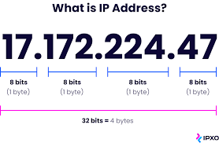
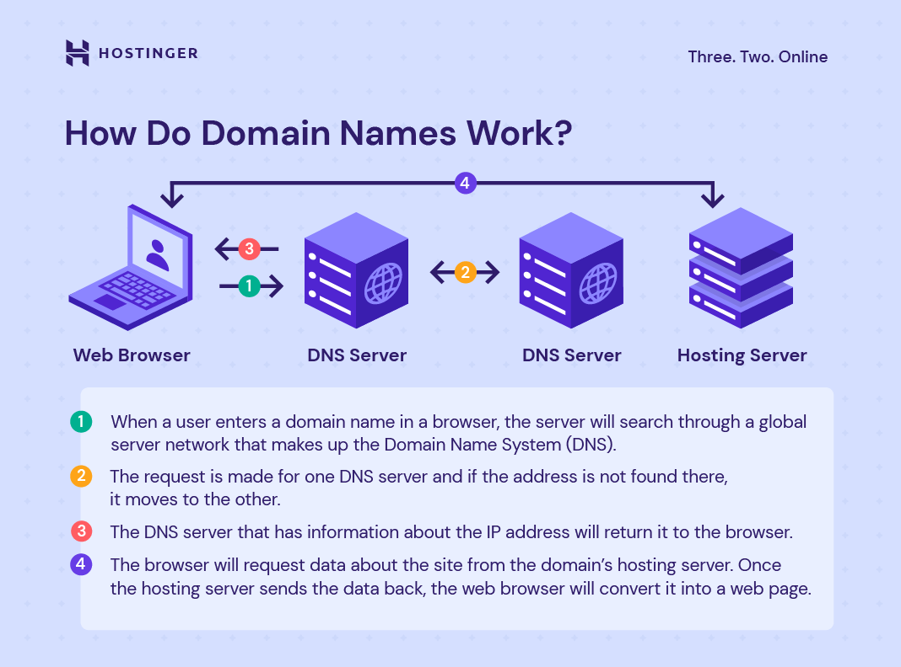

# What-is-Internet

[What is DNS](https://www.cloudflare.com/learning/dns/what-is-dns/)

## DNS

The Domain Name System (DNS) is the phonebook of the Internet. Humans access information online through domain names, like nytimes.com or espn.com.

## IP address

A unique string of characters that identifies each computer using the Internet Protocol to communicate over a network.

Example:

## Domain

When referring to an Internet address or name, a domain or domain name is the location of a website.

For example, the domain name "google.com" points to the IP address "216.58.216.164". Generally, it's easier to remember a name rather than a long string of numbers

## How Domain names work

- bhot saray computer jor do internet ban jaye ga
- web is inter connected computers
- how web works page 7
- internet (wires cables)
- server
- dns == phone book for ip
- ip address == phone number
- domain == ip address
- $ ping facebook.com ==> 157.240.227.35
- 4G
- cloud vs own server
